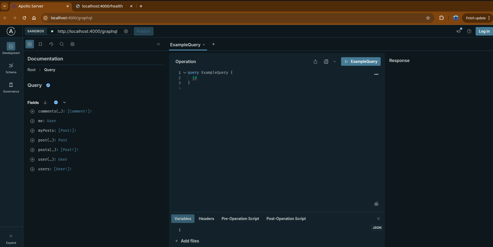
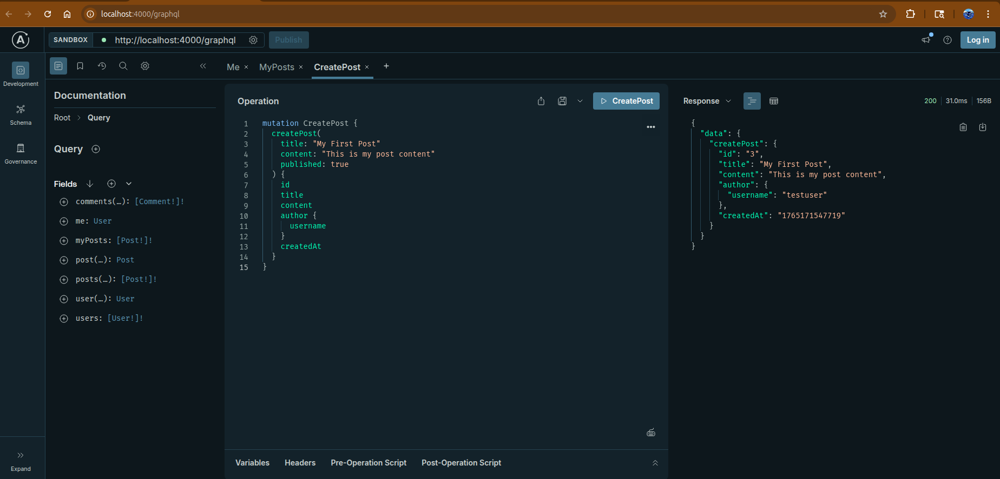
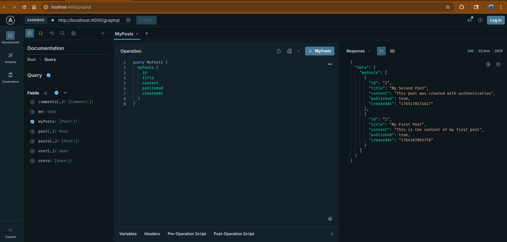
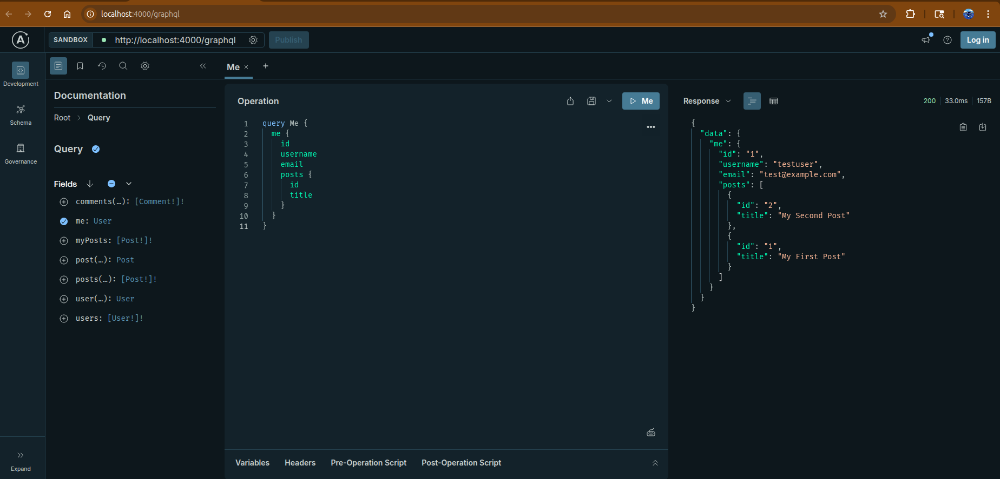

# Node.js GraphQL API

A production-ready GraphQL API built with Apollo Server v5, Express, PostgreSQL, and TypeScript.  
It provides authentication, authorization, and full CRUD operations for users, posts, and comments — ideal as a foundation for blogs, content platforms, SaaS backends, and internal tools.

---

## Problem This Solves

Most applications need a secure, flexible backend to handle users, posts, comments, and permissions.  
Designing the schema, handling authentication, connecting to a database, and wiring all of this for production takes time and experience.

This project delivers a **ready-to-use GraphQL backend** that already solves those problems:

- User accounts with secure login
- Role/ownership-based access to content
- Posts and comments with clean relationships
- A schema that is easy to extend for new features

---

## Core Features

- **Modern GraphQL API** with Apollo Server v5
- **JWT authentication** with bcrypt password hashing
- **Authorization & ownership checks** for protected operations
- **PostgreSQL 16 database** with connection pooling
- **TypeScript 5** for type safety and maintainability
- **Users, posts, comments**: full CRUD and relations
- **Health check endpoint** for uptime monitoring
- **Docker & Docker Compose** for production-friendly deployment
- **Auto table creation** on startup (no manual migrations needed to begin)

---

## Why This Matters for Your Project

- **Fast start for new products:** Drop in a working backend for content apps, blogs, portals, or MVPs.
- **Clean architecture:** Separation of schema, resolvers, database utilities, and auth logic makes changes safe and predictable.
- **Secure by design:** Hashed passwords, JWT auth, and ownership checks reduce security mistakes in production.
- **Easy integration:** Frontends (React, Next.js, mobile apps) can consume a single GraphQL endpoint.
- **Deployment-ready:** Environment-based configuration and Docker support make it easy to ship to any cloud provider.

---

## Tech Stack

- **Runtime:** Node.js 22 (LTS)
- **Framework:** Express 4
- **GraphQL:** Apollo Server 5
- **Database:** PostgreSQL 16
- **Auth:** JWT (`jsonwebtoken`) + `bcrypt`
- **Language:** TypeScript 5
- **Dev tools:** `nodemon`, `ts-node`
- **Containerization:** Docker & Docker Compose

---

## Installation

### 1. Clone the Repository

```bash
git clone https://github.com/nandolabs/nodejs-graphql-api.git
cd nodejs-graphql-api
````

### 2. Install Dependencies

```bash
npm install
```

### 3. Configure Environment Variables

Create a `.env` file in the project root:

```env
PORT=4000
DB_HOST=localhost
DB_PORT=5432
DB_NAME=graphql_db
DB_USER=postgres
DB_PASSWORD=your_password_here
JWT_SECRET=your_super_secret_jwt_key_change_this_in_production
JWT_EXPIRES_IN=7d
```

### 4. Create PostgreSQL Database

```bash
psql -U postgres

CREATE DATABASE graphql_db;
\q
```

The application will automatically create the required tables on startup.

### 5. Run the Application

**Development:**

```bash
npm run dev
```

**Production build:**

```bash
npm run build
npm start
```

The API will be available at:

```text
http://localhost:4000/graphql
```

---

## Docker Deployment

### Using Docker Compose (recommended)

```bash
# Build and start API + PostgreSQL
docker-compose up --build

# Detached mode
docker-compose up -d

# Stop services
docker-compose down

# View API logs
docker-compose logs -f api
```

### Manual Docker Build

```bash
docker build -t nodejs-graphql-api .
docker run -p 4000:4000 --env-file .env nodejs-graphql-api
```

---

## API Overview

### GraphQL Endpoint

* **URL:** `http://localhost:4000/graphql`
* Works with Apollo Studio / GraphQL Playground for interactive testing.

### Health Check

```bash
curl http://localhost:4000/health
# -> {"status":"OK"}
```

---

## Authentication

The API uses **JWT** for authentication.

Include the token in the `Authorization` header:

```text
Authorization: Bearer <your_jwt_token>
```

---

## GraphQL Schema (High-Level Overview)

### Types

* **User**

  * `id`, `username`, `email`, `posts`, `createdAt`
* **Post**

  * `id`, `title`, `content`, `published`, `author`, `comments`, `createdAt`, `updatedAt`
* **Comment**

  * `id`, `content`, `author`, `post`, `createdAt`
* **AuthPayload**

  * `token`, `user`

---

## Example Queries & Mutations

### Get Current User

```graphql
query {
  me {
    id
    username
    email
    posts {
      id
      title
    }
  }
}
```

### Register New User

```graphql
mutation {
  register(
    username: "johndoe"
    email: "john@example.com"
    password: "securepassword123"
  ) {
    token
    user {
      id
      username
      email
    }
  }
}
```

### Login

```graphql
mutation {
  login(
    email: "john@example.com"
    password: "securepassword123"
  ) {
    token
    user {
      id
      username
      email
    }
  }
}
```

### Create Post (Authenticated)

```graphql
mutation {
  createPost(
    title: "My First Post"
    content: "This is the content of my post"
    published: true
  ) {
    id
    title
    content
    published
    author {
      username
    }
    createdAt
  }
}
```

---

## Testing with cURL

### Register New User

```bash
curl -X POST http://localhost:4000/graphql \
  -H "Content-Type: application/json" \
  -d '{
    "query": "mutation { register(username: \"johndoe\", email: \"john@example.com\", password: \"password123\") { token user { id username email } } }"
  }'
```

**Response:**
```json
{
  "data": {
    "register": {
      "token": "eyJhbGciOiJIUzI1NiIsInR5cCI6IkpXVCJ9...",
      "user": {
        "id": "2",
        "username": "johndoe",
        "email": "john@example.com"
      }
    }
  }
}
```

### Login

```bash
curl -X POST http://localhost:4000/graphql \
  -H "Content-Type: application/json" \
  -d '{
    "query": "mutation { login(email: \"test@example.com\", password: \"password123\") { token user { id username email } } }"
  }'
```

**Response:**
```json
{
  "data": {
    "login": {
      "token": "eyJhbGciOiJIUzI1NiIsInR5cCI6IkpXVCJ9...",
      "user": {
        "id": "1",
        "username": "testuser",
        "email": "test@example.com"
      }
    }
  }
}
```

### Create Post (Requires Authentication)

```bash
curl -X POST http://localhost:4000/graphql \
  -H "Content-Type: application/json" \
  -H "Authorization: Bearer YOUR_JWT_TOKEN" \
  -d '{
    "query": "mutation { createPost(title: \"My Post\", content: \"Post content\", published: true) { id title content author { username } createdAt } }"
  }'
```

**Response:**
```json
{
  "data": {
    "createPost": {
      "id": "2",
      "title": "My Post",
      "content": "Post content",
      "author": {
        "username": "testuser"
      },
      "createdAt": "1765170374617"
    }
  }
}
```

### Query All Posts

```bash
curl -X POST http://localhost:4000/graphql \
  -H "Content-Type: application/json" \
  -d '{
    "query": "query { posts { id title content author { username } } }"
  }'
```

**Response:**
```json
{
  "data": {
    "posts": [
      {
        "id": "1",
        "title": "My First Post",
        "content": "This is the content of my first post",
        "author": {
          "username": "testuser"
        }
      }
    ]
  }
}
```

### Get My Posts (Requires Authentication)

```bash
curl -X POST http://localhost:4000/graphql \
  -H "Content-Type: application/json" \
  -H "Authorization: Bearer YOUR_JWT_TOKEN" \
  -d '{
    "query": "query { myPosts { id title content published createdAt } }"
  }'
```

**Response:**
```json
{
  "data": {
    "myPosts": [
      {
        "id": "2",
        "title": "My Second Post",
        "content": "This post was created with authentication",
        "published": true,
        "createdAt": "1765170374617"
      }
    ]
  }
}
```

### Create Comment (Requires Authentication)

```bash
curl -X POST http://localhost:4000/graphql \
  -H "Content-Type: application/json" \
  -H "Authorization: Bearer YOUR_JWT_TOKEN" \
  -d '{
    "query": "mutation { createComment(postId: \"1\", content: \"Great post!\") { id content author { username } createdAt } }"
  }'
```

**Response:**
```json
{
  "data": {
    "createComment": {
      "id": "1",
      "content": "Great post!",
      "author": {
        "username": "testuser"
      },
      "createdAt": "1765170508292"
    }
  }
}
```

---

## API Screenshots

### GraphQL Playground



### Create Post Example



### List Posts Example



### List Users Example



---

### NandoLabs

Building high-quality backend services with clarity, performance, and maintainability.
